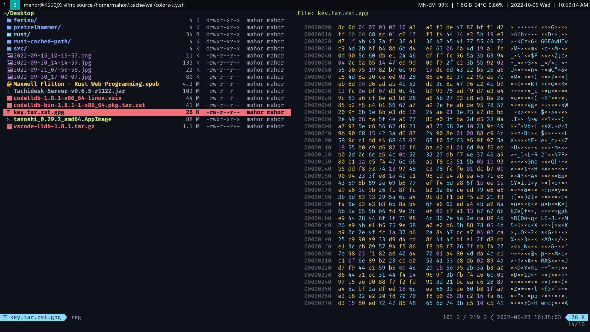
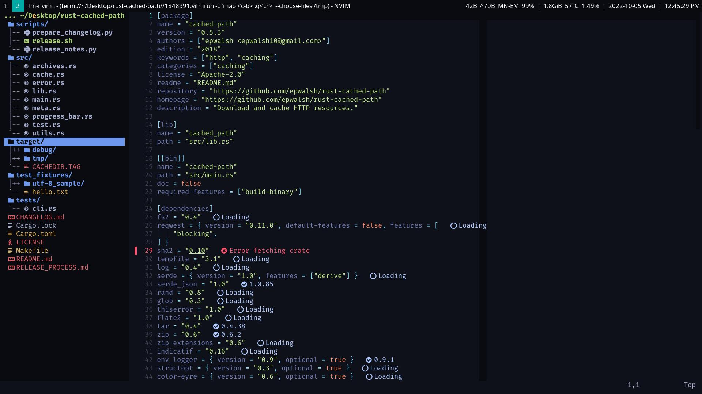

# material.vifm
[Vifm](https://github.com/vifm/vifm/) colorscheme similar to [material.vim](https://github.com/kaicataldo/material.vim)/[material.nvim](https://github.com/marko-cerovac/material.nvim)
- Standalone:


- Inside Nvim with [fm-nvim](https://github.com/is0n/fm-nvim) (or [vifm.vim](https://github.com/vifm/vifm.vim)):


## Installation
- move [colors/material.vifm](https://github.com/mahor1221/material.vifm/blob/master/colors/material.vifm) to `~/.config/vifm/colors/`
- read [vifmrc](https://github.com/mahor1221/material.vifm/blob/master/vifmrc) to see some recommended configurations and how to make fileviewser more colorful
- set your terminal to use material colors. example config for `~/.config/alacritty/alacritty.yml`:

```yaml
colors:
  normal:
    black:   '#1d1f21'
    red:     '#f07178'
    green:   '#c3e88d'
    yellow:  '#ffcb6b'
    blue:    '#82aaff'
    magenta: '#c792ea'
    cyan:    '#89ddff'
    white:   '#eeffff'
  bright:
    black:   '#666666'
    red:     '#ff8b92'
    green:   '#ddffa7'
    yellow:  '#ffe585'
    blue:    '#9cc4ff'
    magenta: '#e1acff'
    cyan:    '#a3f7ff'
    white:   '#ffffff'
```

- (Optional) Install [vifm_devicons](https://github.com/cirala/vifm_devicons) to display icons
- (Optional) Install [hexyl](https://github.com/sharkdp/hexyl) to preview unknown binary files
- (Optional) Install [highlight](http://www.andre-simon.de/doku/highlight/highlight.php) to preview with syntax highlighting
- (Optional) Install [vifmimg](https://github.com/cirala/vifmimg) to display images
